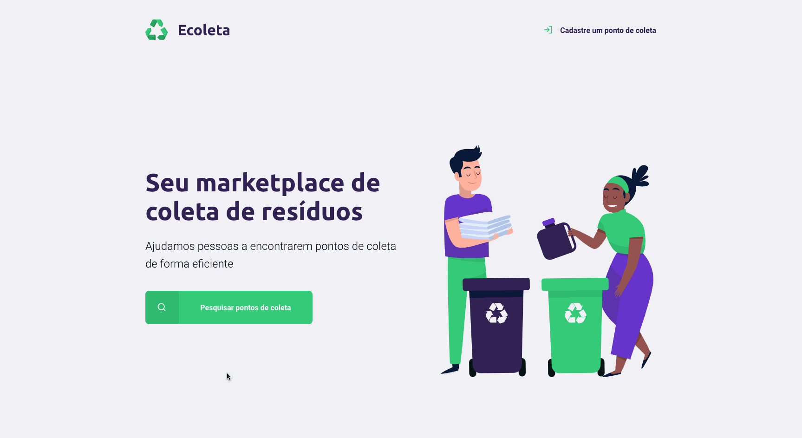

<h1 align="center">
    
</h1>
<h1 align="center">
    
</h1>

## 📋 Sobre

**Ecoleta** foi criado em uma semana pelo evento promovido pela @Rocketseat **Next Level Week**

## 🚀 Tecnologias

- [Express](https://github.com/expressjs/express)
- [Html](https://developer.mozilla.org/pt-BR/docs/Web/HTML)
- [CSS](https://developer.mozilla.org/pt-BR/docs/Web/CSS)
- [JavaScript](https://developer.mozilla.org/pt-BR/docs/Aprender/JavaScript)
- [Npm](https://www.npmjs.com/)


## 🛠️ Tools
- [Visual Studio Code](https://code.visualstudio.com)
- [Mozilla Developer Edition](https://www.mozilla.org/pt-BR/firefox/developer/)
- [Hyper Terminal](https://hyper.is/)
- [SQlite](https://www.sqlite.org/index.html)
- [Git](https://git-scm.com/)


## 🎮 Como usar
```
1. Clonando o repositório 
$ git clone https://github.com/clestonv/nlw.git

2. Acessando o diretório do projeto 
$ cd nlw

3. Instalando as dependências 
$ npm install

4. Executando 
$ npm start
```


Feito por Cleberson Osorio 🌊